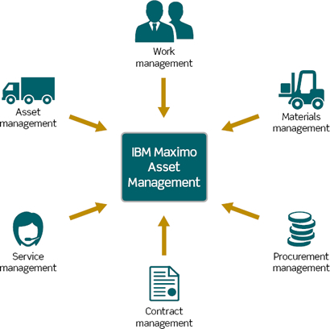

# Log_Analyser
Using Big Data Technologies to analyse application logs as per requirement

Maximo Application when deployed in a clustered environment and functioning on multiple Java Virtual Machines can lead to generation of many log files everyday. These log files based on logging level can range from 5 MB-800 MB in size. Based on our requirement and need to debug certain issues, we may need to go through these log files to detect anomalies. But going through any 100 mb log file even though for a particular time duration can be draining. This is because a lot of services write to log files simultaneously. For a need of easy extraction and saving manual hours I came up with using Spark application to perform this task.

Objective : In the attached spark job, I have tried to extract SQL statements logged in the application that take more than 3 seconds(customizable limit in maximo) to execute.
Outcome : Using this Data , we can extract the sql statements in excel sheet , sorted in the order of maximum time taken. This order will help us to identify most resource intensive SQL statement which in turn can point us in the direction of optimising SQL queries, hence improving the performance of the system

<B>About Spark:</B>

Apache Spark is a open source framework for real time data analytics in a distributed computing environment. It executes in-memory computations to increase speed of data processing. It is faster for processing large scale data as it exploits in-memory computations and other optimizations. Therefore, it requires high processing power.
Resilient Distributed Dataset (RDD) is a fundamental data structure of Spark. It is an immutable distributed collection of objects. Each dataset in RDD is divided into logical partitions, which may be computed on different nodes of the cluster. RDDs can contain any type of Python, Java, or Scala objects, including user-defined classes. Spark components make it fast and reliable. Following image shows the different spark components.

Spark performs its operations on RDDs. There are two types of operations: Transformation and Action. 
Transformation is functions like map, reduce, filter (functions used often in python functional programming). Actions is functions used to count or collect(print) the data. 
Whenever a transformation is performed on RDD, Spark doesn’t execute it right away. Instead it creates a DAG (Directed Acyclic Graph) for these transformations and the following transformations. The RDD is evaluated only when the action operation is called on it. This is also called as Lazy evaluation which makes it good for spark to perform optimization once it has the chance to look at the RDD in its entirety.

More info : https://spark.apache.org/

<B>About Maximo:</B>

IBM Maximo® optimizes performance, extends asset life cycles, and reduces operational downtime and costs. OT and IT leaders can use Maximo to operate high-value physical assets with visibility and control across the enterprise. Streamline your global operations from procurement to contract management, and manage costs through a subscription-based model. Maintain all asset types no matter where they reside, set up new assets quickly and upgrade enterprise asset management (EAM) software automatically for nonstop uptime, reduced costs and minimized risk. Source : https://www.ibm.com/in-en/products/maximo
